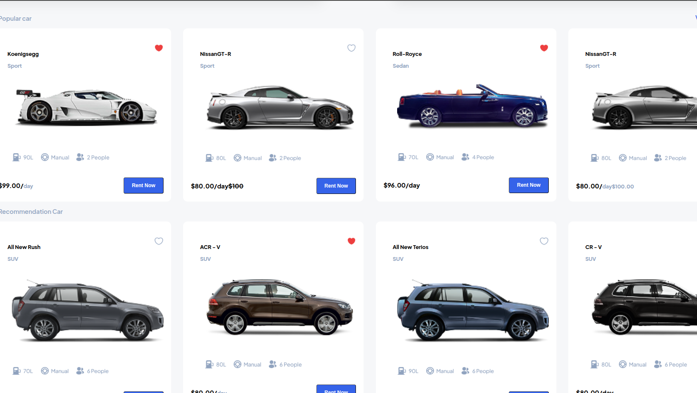

# Car Rent Site Design- Pickolab Studio

## Project description
Replicating a Figma design of a car rent site using only *HTML and CSS* (no JavaScript).

**Code snippet**

```HTML
    <section class="popular-cars">
                <div class="pop-car">
                    <p class="pop-carp">Popular car</p>
                    <p class="view-all">View All</p>
                </div>
                <section class="popular-cars-grid">
                    <div class="popular-specs">
                        <div class="car-models">
                            <div class="car-specs">
                                <p>Koenigsegg</p>
                                <span>Sport</span>
                            </div>
                            <span></span>
                        </div>

                            

                        <div>
                            
                        </div>
                        <div class="car-btn">
                            <strong>$99.00/<span>day</span></strong>
                            <button type="button" class="rent-btn">Rent Now</button>
                        </div>
                    </div>
   
```

## Web page Preview



## About
I have replicated a Figma design of **Car Rent Site** using HTML and CSS. Some concepts used and implemented include;
- Flexbox and CSS Grid for layout
- Semantic HTML
- Google Fonts
- Responsive design for mobile

This is the [Figma design](https://www.figma.com/design/PB6gdHlUaagtwNG5MgDR5g/Car-Rent-Website-Design---Pickolab-Studio--Community-?node-id=1-5&p=f&t=4WPoA5Em61GpM237-0) which you can compare with my own outcome.

This project has a structure of:
> /index.html
> /styles/style.css
> /assets
> /README.md

### Author

**Love Asoh**

- GitHub: [@loveasoh](https://github.com/AsohLove)
- Twitter: [@loveasoh](https://x.com/LoveTheModifier)
- LinkedIn: [love asoh](https://www.linkedin.com/in/asohlove/)


## License
This project is [MIT](./LICENSE) licensed.